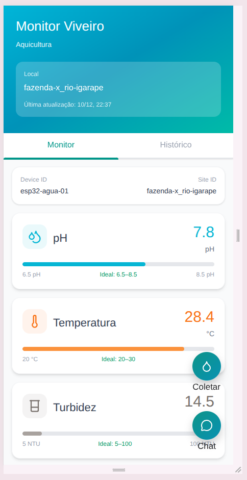

# 🐟 Sistema de Monitoramento de Qualidade da Água - Viveiro de Peixes

Sistema mobile desenvolvido em **Ionic React + TypeScript** para monitoramento em tempo real da qualidade da água em viveiros de criação de peixes, com integração ao Firebase/Firestore, chatbot inteligente e controle remoto via MQTT.

---

## 📋 Pré-requisitos

### Node.js

O projeto requer **Node.js versão 16 ou superior**.

**Verificar versão instalada:**

```bash
node -v
npm -v
```

**Instalar/Atualizar Node.js:**

**Linux (Ubuntu/Debian):**

```bash
# Usando NodeSource (recomendado)
curl -fsSL https://deb.nodesource.com/setup_20.x | sudo -E bash -
sudo apt-get install -y nodejs

# Ou usando NVM (Node Version Manager)
curl -o- https://raw.githubusercontent.com/nvm-sh/nvm/v0.39.0/install.sh | bash
source ~/.bashrc
nvm install 20
nvm use 20
```

**Windows:**

- Baixe o instalador em: https://nodejs.org/
- Execute o instalador `.msi` e siga as instruções
- Reinicie o terminal após a instalação

---

## 🚀 Instalação

### 1. Instalar Ionic CLI e Capacitor

**Linux/macOS:**

```bash
sudo npm install -g @ionic/cli @capacitor/core @capacitor/cli
```

**Windows (Execute como Administrador):**

```bash
npm install -g @ionic/cli @capacitor/core @capacitor/cli
```

**Verificar instalação:**

```bash
ionic --version
```

### 2. Clonar/Baixar o Projeto

```bash
# Se estiver em um repositório Git
git clone <url-do-repositorio>
cd <nome-do-projeto>
```

### 3. Instalar Dependências

```bash
npm install
```

Isso instalará todas as dependências listadas no `package.json`, incluindo:

- React
- Ionic React
- Firebase/Firestore
- Lucide React (ícones)
- TypeScript
- Tailwind CSS
- Recharts (gráficos)
- MQTT (protocolo de mensageria)

---

## 🏃 Executando o Projeto

### Modo Desenvolvimento (Navegador)

```bash
ionic serve
```

O aplicativo abrirá automaticamente em `http://localhost:8100`

**Modo de visualização mobile:**

- Pressione `F12` no navegador para acessar o DevTools
- Clique no ícone de dispositivo móvel (Device Toolbar)
- Selecione um dispositivo móvel (ex: iPhone, Samsung Galaxy)

### Build para Produção (ainda em andamento)

```bash
ionic build --prod
```

---

## 📸 Screenshots

Imagem do aplicativo



---

## ⚙️ Configuração do Firebase

O projeto utiliza **Firebase Firestore** para armazenamento e sincronização de dados em tempo real.

### 1. Criar Projeto no Firebase (caso ainda não tenha configurado)

1. Acesse: https://console.firebase.google.com/
2. Clique em "Adicionar projeto"
3. Siga as instruções para criar um novo projeto
4. Ative o **Firestore Database** em modo de teste ou produção

### 2. Obter Credenciais

1. No console do Firebase, vá em **Configurações do Projeto** (ícone de engrenagem)
2. Role até "Seus aplicativos" e clique no ícone **</>** (Web)
3. Registre seu app e copie as credenciais do `firebaseConfig`

### 3. Configurar no Projeto

Edite o arquivo `/services/firestore.ts` e adicione suas credenciais:

```typescript
const firebaseConfig = {
  apiKey: "SUA_API_KEY",
  authDomain: "SEU_AUTH_DOMAIN",
  projectId: "SEU_PROJECT_ID",
  storageBucket: "SEU_STORAGE_BUCKET",
  messagingSenderId: "SEU_MESSAGING_SENDER_ID",
  appId: "SEU_APP_ID",
};
```

### 4. Estrutura do Firestore

Crie uma coleção chamada `telemetry` com documentos no formato do exemplo:

```json
{
  "version": "1.0.0",
  "msg_type": "telemetry",
  "device_id": "esp32-agua-01",
  "site_id": "fazenda-x_rio-igarape",
  "sent_at": "2025-10-02T10:42:00-03:00",
  "seq": 1235,
  "measurements": [
    {
      "parameter": "pH",
      "value": 7.18,
      "unit": "pH",
      "temp_compensated": true,
      "uncertainty": 0.03,
      "method": "eletrodo_vidro + PH4502C",
      "calibration_id": "cal-2025-09-29-pH-2pts",
      "raw": { "adc": 13211, "voltage_v": 2.41, "temp_c": 25.6, "slope_mV_per_pH": -58.1 }
    },
    {
      "parameter": "temperature",
      "value": 25.6,
      "unit": "°C",
      "method": "DS18B20",
      "raw": { "rom": "28-FFA1B233A1C4", "resolution_bits": 12 }
    },
    {
      "parameter": "turbidity",
      "value": 4.2,
      "unit": "NTU",
      "method": "SEN0189/ST100",
      "raw": { "adc": 9112, "voltage_v": 1.66 }
    },
    {
      "parameter": "tds",
      "value": 320,
      "unit": "ppm",
      "method": "Gravity TDS (k=1.0)",
      "raw": { "adc": 10440, "voltage_v": 1.90, "ec_uS_cm": 640 }
    }
  ],
  "power": { "battery_v": 3.92, "usb_power": false },
  "rssi_dbm": -61,
  "fw": { "app": "safra-dourada-probe", "ver": "0.6.3" }
}
```

---

## 📱 Deploy Mobile (Android/iOS)

### Android

**0. Java 21 (requerido pelo Gradle/Capacitor 7):**

```bash
brew install openjdk@21
echo 'export PATH="/opt/homebrew/opt/openjdk@21/bin:$PATH"' >> ~/.zshrc
echo 'export JAVA_HOME="/opt/homebrew/opt/openjdk@21/libexec/openjdk.jdk/Contents/Home"' >> ~/.zshrc
exec $SHELL
```

**1. Adicionar plataforma Android (somente na primeira vez):**

```bash
ionic capacitor add android
```

**2. Build e sincronizar:**

```bash
ionic build
ionic capacitor sync android
```

**3. Rodar direto no emulador (exemplo):**

```bash
JAVA_HOME=/opt/homebrew/opt/openjdk@21/libexec/openjdk.jdk/Contents/Home \
PATH="/opt/homebrew/opt/openjdk@21/bin:$PATH" \
npx cap run android --target emulator-5556
```

> Altere `emulator-5556` para o ID retornado por `adb devices`.

**4. Abrir no Android Studio (opcional):**

```bash
ionic capacitor open android
```

### iOS (somente macOS)

**1. Adicionar plataforma iOS:**

```bash
ionic capacitor add ios
```

**2. Build e sincronizar:**

```bash
ionic build
ionic capacitor sync ios
```

**3. Abrir no Xcode:**

```bash
ionic capacitor open ios
```

---

## 🎨 Funcionalidades

### ✅ Implementadas

- 📊 **Monitoramento em Tempo Real**: Visualização instantânea dos parâmetros de qualidade da água
- 🔄 **Sincronização Firebase**: Dados atualizados automaticamente via Firestore
- 📈 **Indicadores Visuais**: Barras coloridas mostrando posição dentro da faixa ideal
- 🎯 **Parâmetros Monitorados**:
  - pH (6.5 - 8.5)
  - Temperatura (20°C - 30°C)
  - Turbidez (0 - 10 NTU)
  - Condutividade/TDS (0 - 500 ppm)
- 📱 **Interface Responsiva**: Design otimizado para dispositivos móveis
- ⚡ **Estados de Loading**: Feedback visual durante carregamento e erros
- ♿ **Acessibilidade**: Labels ARIA para leitores de tela
- 📜 **Histórico Avançado**: 
  - Visualização de dados históricos com gráficos de linha
  - Filtros de período (24h, 7 dias, 30 dias)
  - Estatísticas (mínimo, média, máximo)
  - Lista de leituras recentes com status
  - Indicadores de tendência (crescente/decrescente/estável)
- 🤖 **Chatbot Inteligente**:
  - Assistente virtual para dúvidas sobre qualidade da água
  - Sugestões de perguntas pré-definidas
  - Interface de chat intuitiva com balões de mensagem
  - Preparado para integração com LLM (backend)
- 📡 **Controle Remoto via MQTT**:
  - Botão para disparar coleta de dados na ESP32
  - Feedback visual de status (conectando, medindo, sucesso, erro)
  - Comunicação bidirecional com dispositivos IoT

### 🚧 Em Desenvolvimento

- 🔔 **Alertas**: Notificações quando valores saem da faixa ideal
- 📥 **Exportação de Dados**: Download de relatórios em PDF/CSV
- 🌐 **Integração LLM**: Conexão do chatbot com backend de IA
- 🔐 **Autenticação**: Sistema de login e gerenciamento de múltiplos viveiros

---

## 🗂️ Estrutura do Projeto

```
/
├── components/          # Componentes React reutilizáveis
│   ├── HeaderCard.tsx      # Cabeçalho com informações do local
│   ├── Tabs.tsx            # Navegação Monitor/Histórico
│   ├── MetricCard.tsx      # Card de exibição de métricas
│   ├── IdealRangeBar.tsx   # Barra de progresso com faixa ideal
│   ├── HistoryView.tsx     # Tela de histórico com gráficos
│   ├── ChatbotView.tsx     # Interface do chatbot
│   └── MeasureButton.tsx   # Botões flutuantes para coleta de dados e chatboot
├── services/
│   ├── firestore.ts        # Integração com Firebase/Firestore
│   └── mqtt.ts             # Serviço MQTT para controle da ESP32
├── types/
│   └── telemetry.ts        # Tipos de dados de telemetria
├── utils/
│   ├── idealRanges.ts      # Configuração de faixas ideais
│   └── parameterConfig.ts  # Configuração de parâmetros (cores, ícones)
├── styles/
│   └── globals.css         # Tailwind CSS + variáveis customizadas
├── App.tsx               # Componente principal com navegação
└── main.tsx              # Ponto de entrada da aplicação
```

---

## 🛠️ Tecnologias Utilizadas

- **[Ionic Framework](https://ionicframework.com/)** - Framework mobile híbrido
- **[React](https://react.dev/)** - Biblioteca JavaScript para interfaces
- **[TypeScript](https://www.typescriptlang.org/)** - Superset tipado de JavaScript
- **[Firebase/Firestore](https://firebase.google.com/)** - Banco de dados em tempo real
- **[Tailwind CSS](https://tailwindcss.com/)** - Framework CSS utilitário
- **[Lucide React](https://lucide.dev/)** - Biblioteca de ícones
- **[Capacitor](https://capacitorjs.com/)** - Runtime nativo para apps híbridos
- **[Recharts](https://recharts.org/)** - Biblioteca de gráficos para React
- **[MQTT](https://mqtt.org/)** - Protocolo de mensageria para IoT

---

## 🤖 Configuração do Chatbot (Backend LLM)

O chatbot está preparado para integração com um backend de IA. Para implementar:

### 1. Criar endpoint de API

Crie um backend (Node.js, Python, etc.) com endpoint para processar mensagens:

```typescript
// Exemplo de endpoint esperado
POST https://seu-backend.com/api/chat

// Body
{
  "message": "Como melhorar a qualidade da água?",
  "context": "aquicultura",
  "deviceId": "esp32-agua-01"
}

// Response
{
  "response": "Para melhorar a qualidade da água...",
  "suggestions": ["Pergunta relacionada 1", "Pergunta relacionada 2"]
}
```

### 2. Atualizar função no ChatbotView.tsx

Substitua a função `generateMockResponse` por uma chamada real à API:

```typescript
const generateResponse = async (userMessage: string): Promise<string> => {
  const response = await fetch('https://seu-backend.com/api/chat', {
    method: 'POST',
    headers: { 'Content-Type': 'application/json' },
    body: JSON.stringify({ 
      message: userMessage,
      context: 'aquicultura'
    })
  });
  const data = await response.json();
  return data.response;
};
```

### 3. Recomendações de LLM

- **OpenAI GPT-4**: Melhor qualidade de resposta
- **Anthropic Claude**: Boa alternativa
- **Google Gemini**: Opção gratuita com bons resultados
- **Llama 2/3**: Para deploy on-premise

---

## 📡 Configuração do MQTT para ESP32

### 1. Instalar biblioteca MQTT (opcional para produção)

```bash
npm install mqtt
```

### 2. Configurar Broker MQTT

Edite `/services/mqtt.ts` com as credenciais do seu broker:

```typescript
const MQTT_CONFIG: MqttConfig = {
  brokerUrl: 'wss://seu-broker.com:8884/mqtt',
  username: 'seu-usuario',
  password: 'sua-senha',
  clientId: 'web-client-viveiro'
};
```

**Opções de Broker:**
- **HiveMQ Cloud**: https://www.hivemq.com/mqtt-cloud-broker/
- **AWS IoT Core**: https://aws.amazon.com/iot-core/
- **Mosquitto**: https://mosquitto.org/ (self-hosted)
- **CloudMQTT**: https://www.cloudmqtt.com/

### 3. Programar ESP32 para receber comandos

Exemplo de código Arduino/ESP32:

```cpp
#include <WiFi.h>
#include <PubSubClient.h>

const char* mqtt_server = "seu-broker.com";
const char* topic_commands = "devices/esp32-agua-01/commands";

void callback(char* topic, byte* payload, unsigned int length) {
  // Parse JSON: {"command": "measure", "timestamp": "..."}
  if (strstr((char*)payload, "\"command\":\"measure\"")) {
    // Disparar leitura dos sensores
    readSensors();
    publishToFirestore();
  }
}

void setup() {
  client.setCallback(callback);
  client.subscribe(topic_commands);
}
```

### 4. Fluxo de Comunicação

1. **Usuário clica** no botão "Aferir Qualidade" no app
2. **App envia** comando MQTT: `devices/{device_id}/commands`
3. **ESP32 recebe** comando e ativa sensores
4. **ESP32 publica** dados no Firestore
5. **App atualiza** automaticamente via listener do Firestore

---

## 📊 Faixas Ideais dos Parâmetros

| Parâmetro           | Mínimo | Máximo | Unidade | Cor        |
| ------------------- | ------ | ------ | ------- | ---------- |
| pH                  | 6.5    | 8.5    | pH      | 🔵 Ciano   |
| Temperatura         | 20     | 30     | °C      | 🟠 Laranja |
| Turbidez            | 0      | 10     | NTU     | 🟤 Marrom  |
| Condutividade (TDS) | 0      | 500    | ppm     | 🟣 Roxo    |

_As faixas podem ser ajustadas em `/utils/idealRanges.ts` conforme necessidade do viveiro._

---

## 🔧 Troubleshooting

### Erro: "Command not found: ionic"

**Solução:**

```bash
# Reinstalar Ionic CLI globalmente
npm install -g @ionic/cli
```

### Erro: "Firebase not initialized"

**Solução:**

- Verifique se as credenciais do Firebase estão corretas em `/services/firestore.ts`
- Certifique-se de que o Firestore está ativado no console do Firebase
- Descomente o código de conexão real e comente o código mock

### Erro ao instalar dependências (npm install)

**Linux:**

```bash
# Limpar cache do npm
npm cache clean --force
rm -rf node_modules package-lock.json
npm install
```

**Windows:**

```bash
# Limpar cache do npm
npm cache clean --force
del /f /s /q node_modules
del package-lock.json
npm install
```

### Porta 8100 já em uso

```bash
# Especificar outra porta
ionic serve --port=8200
```

---

## 📝 Scripts Disponíveis

```bash
npm install          # Instalar dependências
ionic serve          # Executar em modo desenvolvimento
ionic build          # Build para produção
ionic capacitor add android   # Adicionar plataforma Android
ionic capacitor add ios       # Adicionar plataforma iOS
ionic capacitor sync          # Sincronizar código web com nativo
```

---

## 🎯 Guia de Uso

### Aba Monitor
- Visualize dados em tempo real dos sensores
- Clique no botão flutuante azul (canto inferior direito) para **disparar nova coleta**
- Cada card mostra o valor atual e barra de progresso colorida
- Verde = dentro da faixa ideal | Amarelo/Vermelho = atenção

### Aba Histórico
- Selecione o período: 24h, 7 dias ou 30 dias
- Escolha o parâmetro desejado (pH, Temperatura, etc.)
- Visualize gráfico de tendência e estatísticas
- Role para baixo para ver lista de leituras recentes

### Chatbot Assistente
- Clique no ícone de mensagem (canto inferior direito)
- Use as sugestões ou digite sua pergunta
- Obtenha orientações sobre qualidade da água
- Pressione Enter para enviar, Shift+Enter para nova linha

---

## 👥 Contribuindo

Contribuições são bem-vindas! Para contribuir:

1. Faça um fork do projeto
2. Crie uma branch para sua feature (`git checkout -b feature/nova-funcionalidade`)
3. Commit suas mudanças (`git commit -m 'Adiciona nova funcionalidade'`)
4. Push para a branch (`git push origin feature/nova-funcionalidade`)
5. Abra um Pull Request

---

## 📄 Licença

Este projeto foi desenvolvido para monitoramento de viveiros de peixes.

---

## 📞 Suporte

Para dúvidas ou problemas:

- Abra uma issue no repositório
- Consulte a documentação do [Ionic](https://ionicframework.com/docs)
- Consulte a documentação do [Firebase](https://firebase.google.com/docs)

---

**Desenvolvido com 💙 para melhor gestão de viveiros de peixes**