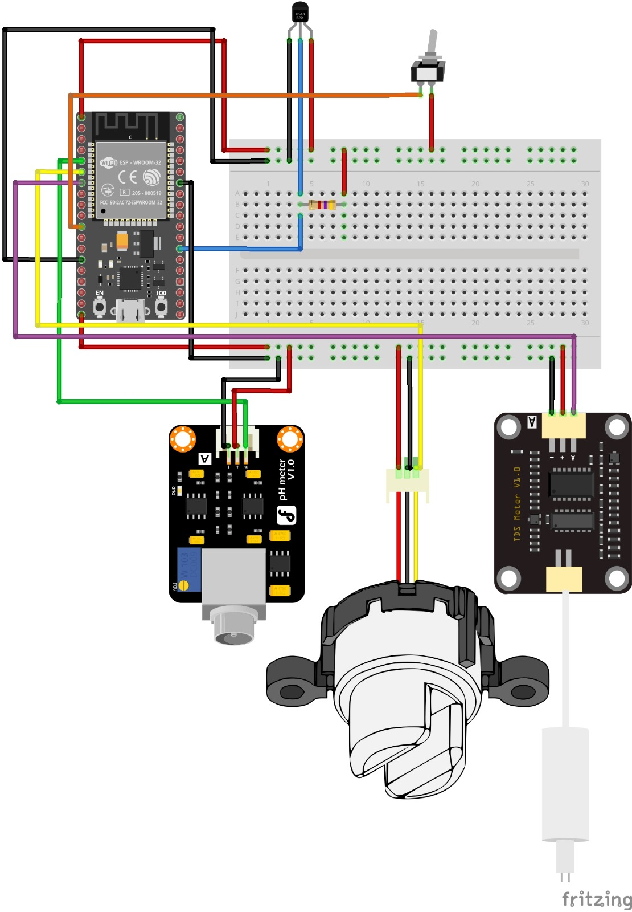
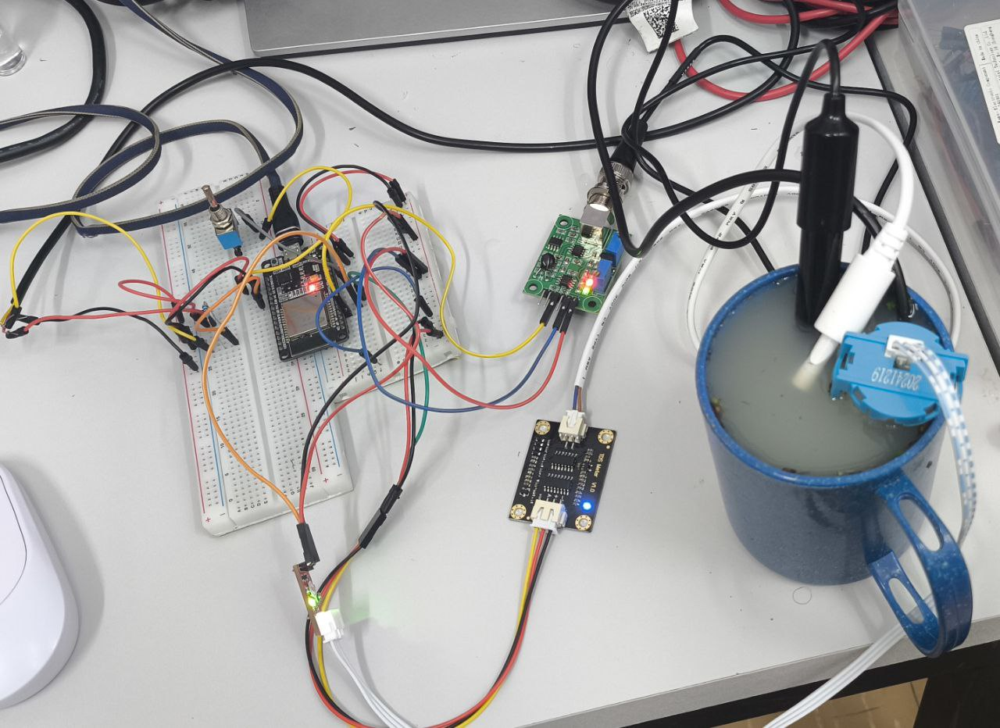
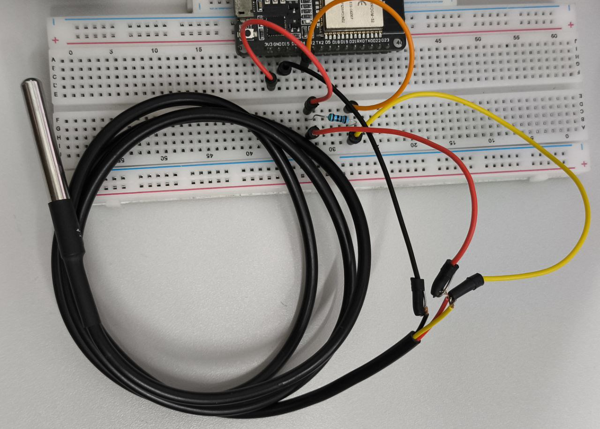
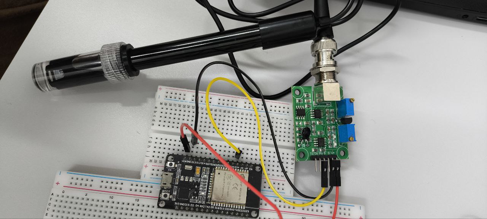
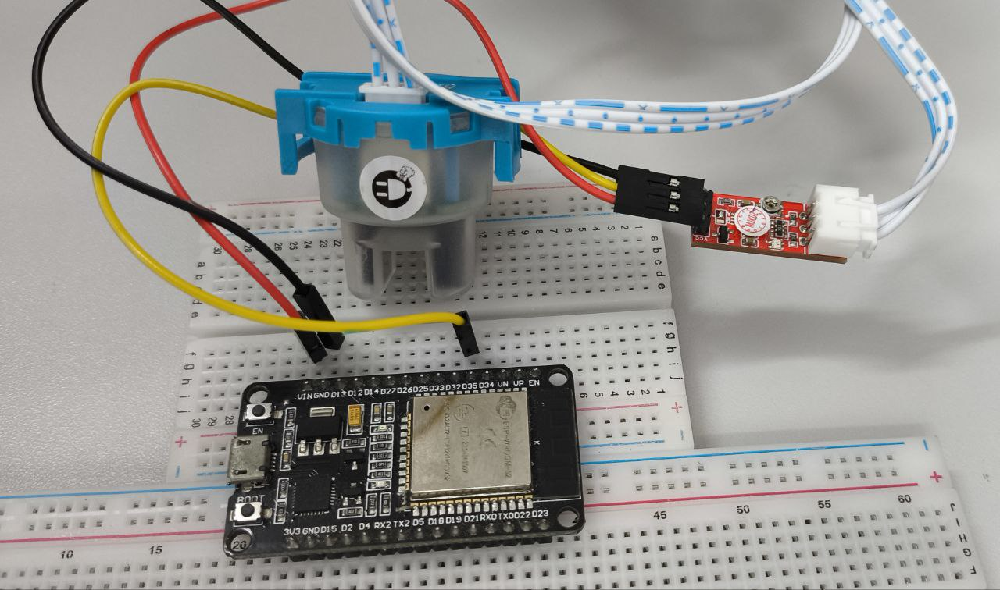
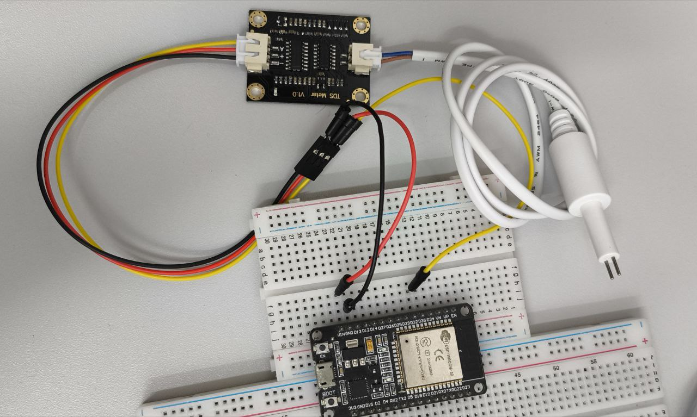
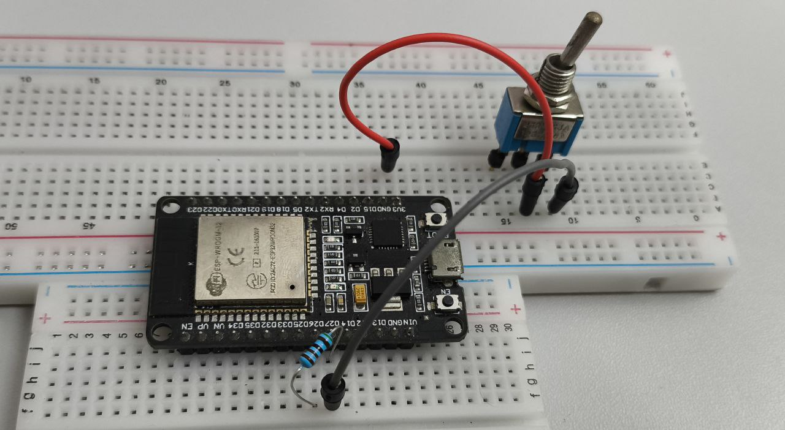

# Montagem Completa do Sistema Aqua-Monitor

## 1. Visão Geral do Hardware

Este sistema utiliza uma ESP32 para leitura e envio de dados de quatro sensores: 

1. **Sensor de Temperatura DS18B20 (OneWire – digital)**
2. **Sensor de pH PH4502C (analógico)**
3. **Sensor de Turbidez SEN0189 (analógico)**
4. **Sensor de Condutividade/TDS Gravity (analógico)**

Uma chave física ou comando MQTT pode iniciar a coleta manual.

## 2. Diagrama do Circuito Completo

### 2.1 Circuito Simulado



### 2.2 Circuito Real Montado



---

## 3. 🔌 Conexões dos Sensores e Conversões

### 3.1 ❄️ Sensor de Temperatura – DS18B20



**Conexões:**

* VCC → 3.3V
* GND → GND
* DATA → GPIO 4
* Resistor de 4.7kΩ entre DATA e 3.3V

**Conversão de Leitura:**
O protocolo OneWire fornece temperatura digital já convertida. O firmware usa `ds18b20.getTempCByIndex(0)` e aplica fallback caso a leitura seja inválida.

---

### 3.2 🧪 Sensor de pH – PH4502C



**Conexões:**

* VCC → 5V
* GND → GND
* PO → GPIO 34

**Conversão de Tensão para pH:**
O firmware mapeia a tensão medida entre dois valores calibrados:

```cpp
float slope = (7.0f - 4.0f) / (PH7_VOLTAGE - PH4_VOLTAGE);
float ph = 7.0f + slope * (voltage - PH7_VOLTAGE);
```

É obrigatório calibrar usando soluções tampão pH 7 e pH 4.

---

### 3.3 💧 Sensor de Turbidez – SEN0189



**Conexões:**

* VCC → 5V
* GND → GND
* A0 → GPIO 35

**Conversão de Tensão para NTU:**
A saída diminui conforme a água fica mais turva. O firmware usa mapping linear calibrado:

```cpp
float ntu = mapFloat(voltage,
                     TURBIDITY_CLEAR_V, TURBIDITY_MUDDY_V,
                     0.0f, TURBIDITY_MAX_NTU);
```

Valores de referência medidos:

* ~3.50V → água limpa
* ~1.50V → água muito turva
* ~2.75V → sensor fora da água

---

### 3.4 ⚡ Sensor de Condutividade/TDS – Gravity TDS



**Conexões:**

* VCC → 5V
* GND → GND
* A0 → GPIO 32

**Conversão de Tensão para TDS (ppm):**
O firmware usa a fórmula oficial da DFRobot:

```cpp
EC = 133.42*V^3 - 255.86*V^2 + 857.39*V;
EC25 = EC / (1 + 0.02*(temp - 25));
TDS = EC25 * 0.5;
```

A compensação de temperatura utiliza o DS18B20.

---

## 4. 🖲️ Sistema de Coleta (Chave Física ou MQTT)



A coleta de dados pode ser feita de duas formas:

* **Chave física** aplicando 3.3V no GPIO 27.
* **Comando MQTT** recebido pelo firmware.

### Uso do resistor de 5kΩ entre GPIO 26 e 27

O resistor garante que o sinal de acionamento seja seguro, evitando flutuações de tensão e protegendo a ESP32 do curto entre saída digital e entrada.

A ESP32 usa `INPUT_PULLDOWN`, logo a borda de subida (0V → 3.3V) inicia a coleta.

---
